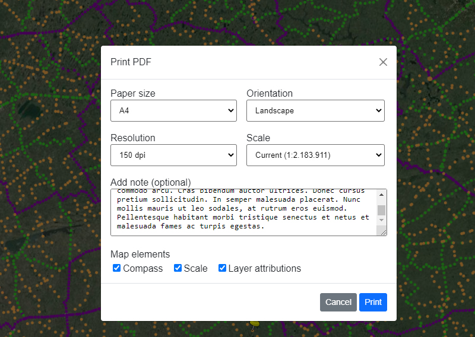
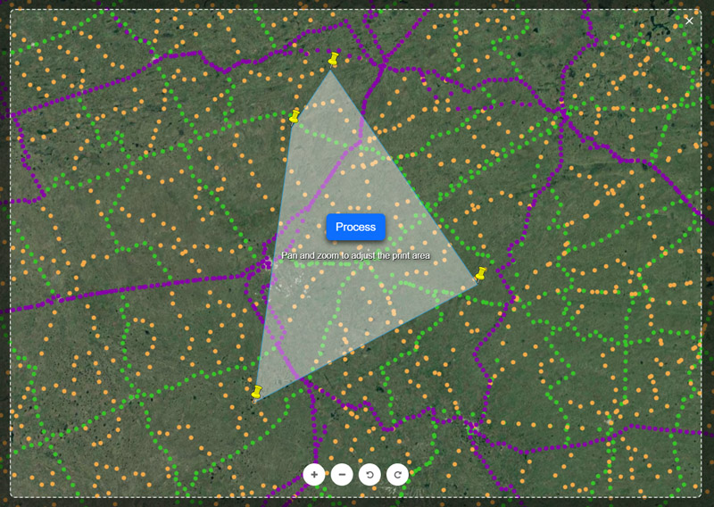

# OpenLayers Pdf Printer

<p align="center">
    <a href="https://www.npmjs.com/package/ol-pdf-printer">
        
    </a>
    <a href="https://img.shields.io/npm/dm/ol-pdf-printer">
        
    </a>
    <a href="https://github.com/gastonzalba/ol-pdf-printer/blob/master/LICENSE">
        
    </a>
</p>

Customizable Pdf Printer Open Layers controñ. It prints the current view of the map, mantaining existing raster and vector layers and allowing to customize the paper size, DPI, map elements to be displayed (compass, cale, legends, etc) and more. It can be used to export to image formats too, like png, jpeg and webp.

Tested with OpenLayers version 5, 6, 7 and 8.

## IMPORTANT

WMS sources and Icons that use external urls must be setted to `crossOrigin: 'anonymous'`. Otherwise, it will ocurr a `DOMException: Failed to execute 'toDataURL' on 'HTMLCanvasElement': Tainted canvases may not be exported`.




## Examples

-   [Basic usage](https://raw.githack.com/GastonZalba/ol-pdf-printer/v2.0.2/examples/basic.html)

## Usage

```js
// Default options
var opt_options = {
    language: 'en',
    i18n: {...}, // Custom translations. Default is according to selected language
    showControlBtn: true,
    filename: 'Ol Pdf Printer',
    allowReframeRegionOfInterest: true,
    units: 'metric',
    extraInfo: {
        date: true,
        url: true,
        scale: true
    },
    mapElements: {
        description: true,
        attributions: true,
        scalebar: true,
        compass: './assets/images/compass.svg',
        legends: true
    },
    watermark: {
        title: 'Ol Pdf Printer',
        subtitle: 'https://github.com/GastonZalba/ol-pdf-printer',
        logo: false
    },
    paperSizes: [
        { size: [594, 420], value: 'A2' },
        { size: [420, 297], value: 'A3' },
        { size: [297, 210], value: 'A4', selected: true },
        { size: [210, 148], value: 'A5' }
    ],
    dpi: [
        { value: 96 },
        { value: 150, selected: true },
        { value: 200 },
        { value: 300 }
    ],
    mimeTypeExport: [
        { value: 'pdf', selected: true},
        { value: 'png' },
        { value: 'jpeg' },
        { value: 'webp' }
    ],
    style: {
        paperMargin: {
            left: 4,
            top: 4,
            right: 4,
            bottom: 4
        },
          watermark: {
            brcolor: '#000000',
            bkcolor: '#ffffff',
            txcolortitle: '#d54b4b',
            txcolorsubtitle: '#444444'
        },
        url: {
            brcolor: '#000000',
            bkcolor: '#ffffff',
            txcolor: '#0077cc'
        },
        specs: {
            brcolor: '#000000',
            bkcolor: '#ffffff',
            txcolor: '#000000'
        },
        scalebar: {
            brcolor: '#000000',
            bkcolor: '#ffffff',
            txcolor: '#000000'
        },
        attributions: {
            brcolor: '#ffffff',
            bkcolor: '#ffffff',
            txcolor: '#666666',
            txcolorlink: '#0077cc'
        },
        legends: {
            brcolor: '#000000',
            bkcolor: '#ffffff',
            txcolor: '#000000'
        },
        description: {
            brcolor: '#333333',
            bkcolor: '#333333',
            txcolor: '#ffffff'
        },
        compass: {
            brcolor: '#000000',
            bkcolor: '#333333'
        }
    },
    dateFormat: undefined, // Use browser default
    ctrlBtnClass: '',
    loader: '<span class="printLoader"></span>',
    modal: {
        animateClass: 'fade',
        animateInClass: 'show',
        transition: 300,
        backdropTransition: 0,
        templates: {
            dialog: '<div class="modal-dialog modal-dialog-centered"></div>',
            headerClose: `<button type="button" class="btn-close" data-dismiss="modal" aria-label="Close"><span aria-hidden="true">×</span></button>`
        }
    }
}

var pdfPrinter = new PdfPrinter(opt_options);

map.addControl(pdfPrinter);
```

## Changelog

See [CHANGELOG](./CHANGELOG.md) for details of changes in each release.

## Install

### Browser

#### JS

Load `ol-pdf-printer.js` after [OpenLayers](https://www.npmjs.com/package/ol), [jspdf](https://www.npmjs.com/package/jspdf) and PDF.js\[https://www.npmjs.com/package/pdfjs-dist]. Ol Pdf Printer is available as `PdfPrinter`.

```HTML
<script src="https://unpkg.com/ol-pdf-printer@2.0.2"></script>
```

#### CSS

```HTML
<link rel="stylesheet" href="https://unpkg.com/ol-pdf-printer@2.0.2/dist/css/ol-pdf-printer.css" />
<link rel="stylesheet" href="https://unpkg.com/ol-pdf-printer@2.0.2/dist/css/bootstrap.min.css" /> <!-- Bootstrap bundle -->
```

### Parcel, Webpack, etc.

NPM package: [ol-pdf-printer](https://www.npmjs.com/package/ol-pdf-printer).
Install the package via `npm`

    npm install ol-pdf-printer --save-dev

#### JS

```js
import PdfPrinter from 'ol-pdf-printer';
```

#### CSS

```js
import 'ol-pdf-printer/dist/css/ol-pdf-printer.min.css';
import 'ol-pdf-printer/dist/css/bootstrap.min.css'; // Personalized bootstrap bundle
//or scss (needs bootstrap installed)
import 'ol-pdf-printer/lib/style/scss/ol-pdf-printer.scss';
```

##### TypeScript type definition

TypeScript types are shipped with the project in the dist directory and should be automatically used in a TypeScript project. Interfaces are provided for the Options.

## API

<!-- Generated by documentation.js. Update this documentation by updating the source code. -->

#### Table of Contents

-   [PdfPrinter](#pdfprinter)
    -   [Parameters](#parameters)
    -   [showPrintSettingsModal](#showprintsettingsmodal)
    -   [hidePrintSettingsModal](#hideprintsettingsmodal)
    -   [createPdf](#createpdf)
        -   [Parameters](#parameters-1)
-   [UnitsSystem](#unitssystem)
-   [IPrintOptions](#iprintoptions)
    -   [format](#format)
    -   [orientation](#orientation)
    -   [resolution](#resolution)
    -   [scale](#scale)
    -   [regionOfInterest](#regionofinterest)
    -   [description](#description)
    -   [compass](#compass)
    -   [attributions](#attributions)
    -   [scalebar](#scalebar)
    -   [legends](#legends)
    -   [safeMargins](#safemargins)
    -   [typeExport](#typeexport)
    -   [url](#url)
    -   [date](#date)
    -   [specs](#specs)
-   [I18n](#i18n)
-   [IPaperSize](#ipapersize)
    -   [size](#size)
    -   [value](#value)
    -   [selected](#selected)
-   [IDpi](#idpi)
    -   [value](#value-1)
    -   [selected](#selected-1)
-   [brcolor](#brcolor)
-   [bkcolor](#bkcolor)
-   [txcolortitle](#txcolortitle)
-   [txcolorsubtitle](#txcolorsubtitle)
-   [brcolor](#brcolor-1)
-   [bkcolor](#bkcolor-1)
-   [txcolor](#txcolor)
-   [brcolor](#brcolor-2)
-   [bkcolor](#bkcolor-2)
-   [txcolor](#txcolor-1)
-   [txcolorlink](#txcolorlink)
-   [brcolor](#brcolor-3)
-   [bkcolor](#bkcolor-3)
-   [txcolor](#txcolor-2)
-   [brcolor](#brcolor-4)
-   [bkcolor](#bkcolor-4)
-   [txcolor](#txcolor-3)
-   [brcolor](#brcolor-5)
-   [bkcolor](#bkcolor-5)
-   [txcolor](#txcolor-4)
-   [brcolor](#brcolor-6)
-   [bkcolor](#bkcolor-6)
-   [txcolor](#txcolor-5)
-   [brcolor](#brcolor-7)
-   [bkcolor](#bkcolor-7)
-   [IStyle](#istyle)
    -   [paperMargin](#papermargin)
-   [IMimeTypeExport](#imimetypeexport)
-   [IModal](#imodal)
    -   [animateClass](#animateclass)
    -   [animateInClass](#animateinclass)
    -   [transition](#transition)
    -   [backdropTransition](#backdroptransition)
    -   [templates](#templates)
-   [IWatermark](#iwatermark)
    -   [title](#title)
    -   [subtitle](#subtitle)
    -   [logo](#logo)
-   [IExtraInfo](#iextrainfo)
    -   [date](#date-1)
    -   [url](#url-1)
    -   [specs](#specs-1)
-   [IMapElements](#imapelements)
    -   [attributions](#attributions-1)
    -   [scalebar](#scalebar-1)
    -   [compass](#compass-1)
    -   [legends](#legends-1)
-   [Options](#options)
    -   [filename](#filename)
    -   [units](#units)
    -   [allowReframeRegionOfInterest](#allowreframeregionofinterest)
    -   [style](#style)
    -   [extraInfo](#extrainfo)
    -   [description](#description-1)
    -   [mapElements](#mapelements)
    -   [watermark](#watermark)
    -   [paperSizes](#papersizes)
    -   [dpi](#dpi)
    -   [mimeTypeExports](#mimetypeexports)
    -   [dateFormat](#dateformat)
    -   [showControlBtn](#showcontrolbtn)
    -   [ctrlBtnClass](#ctrlbtnclass)
    -   [modal](#modal)
    -   [loader](#loader)
    -   [language](#language)
    -   [i18n](#i18n-1)

### PdfPrinter

**Extends ol/control/Control~Control**

#### Parameters

-   `opt_options` **[Options](#options)?**&#x20;

#### showPrintSettingsModal

Show the Settings Modal

Returns **void**&#x20;

#### hidePrintSettingsModal

Hide the Settings Modal

Returns **void**&#x20;

#### createPdf

Create PDF programatically without displaying the Settings Modal

##### Parameters

-   `options` **[IPrintOptions](#iprintoptions)**&#x20;
-   `showLoading` **[boolean](https://developer.mozilla.org/docs/Web/JavaScript/Reference/Global_Objects/Boolean)**&#x20;

Returns **void**&#x20;

### UnitsSystem

**_\[enum]_**

### IPrintOptions

**_\[interface]_**

#### format

Type: any

#### orientation

Type: (`"landscape"` | `"portrait"`)

#### resolution

Type: any

#### scale

Type: [number](https://developer.mozilla.org/docs/Web/JavaScript/Reference/Global_Objects/Number)

#### regionOfInterest

Area of interest. If this is provided,
the scale value is not used

Type: (Extent | Polygon)

#### description

Type: [string](https://developer.mozilla.org/docs/Web/JavaScript/Reference/Global_Objects/String)

#### compass

Type: [boolean](https://developer.mozilla.org/docs/Web/JavaScript/Reference/Global_Objects/Boolean)

#### attributions

Type: [boolean](https://developer.mozilla.org/docs/Web/JavaScript/Reference/Global_Objects/Boolean)

#### scalebar

Type: [boolean](https://developer.mozilla.org/docs/Web/JavaScript/Reference/Global_Objects/Boolean)

#### legends

Type: (LegendsOptions | [boolean](https://developer.mozilla.org/docs/Web/JavaScript/Reference/Global_Objects/Boolean))

#### safeMargins

Type: [boolean](https://developer.mozilla.org/docs/Web/JavaScript/Reference/Global_Objects/Boolean)

#### typeExport

Type: any

#### url

Type: [boolean](https://developer.mozilla.org/docs/Web/JavaScript/Reference/Global_Objects/Boolean)

#### date

Type: [boolean](https://developer.mozilla.org/docs/Web/JavaScript/Reference/Global_Objects/Boolean)

#### specs

Type: [boolean](https://developer.mozilla.org/docs/Web/JavaScript/Reference/Global_Objects/Boolean)

### I18n

**_\[interface]_** - Custom translations specified when creating an instance

### IPaperSize

**_\[interface]_**

#### size

Type: \[[number](https://developer.mozilla.org/docs/Web/JavaScript/Reference/Global_Objects/Number), [number](https://developer.mozilla.org/docs/Web/JavaScript/Reference/Global_Objects/Number)]

#### value

Type: [string](https://developer.mozilla.org/docs/Web/JavaScript/Reference/Global_Objects/String)

#### selected

Type: [boolean](https://developer.mozilla.org/docs/Web/JavaScript/Reference/Global_Objects/Boolean)

### IDpi

**_\[interface]_**

#### value

Type: [number](https://developer.mozilla.org/docs/Web/JavaScript/Reference/Global_Objects/Number)

#### selected

Type: [boolean](https://developer.mozilla.org/docs/Web/JavaScript/Reference/Global_Objects/Boolean)

### brcolor

Watermark border color

Type: [string](https://developer.mozilla.org/docs/Web/JavaScript/Reference/Global_Objects/String)

### bkcolor

Watermark background color

Type: [string](https://developer.mozilla.org/docs/Web/JavaScript/Reference/Global_Objects/String)

### txcolortitle

Watermark title color

Type: [string](https://developer.mozilla.org/docs/Web/JavaScript/Reference/Global_Objects/String)

### txcolorsubtitle

Watermark subtitle color

Type: [string](https://developer.mozilla.org/docs/Web/JavaScript/Reference/Global_Objects/String)

### brcolor

Url border color

Type: [string](https://developer.mozilla.org/docs/Web/JavaScript/Reference/Global_Objects/String)

### bkcolor

Url background color

Type: [string](https://developer.mozilla.org/docs/Web/JavaScript/Reference/Global_Objects/String)

### txcolor

Url text color

Type: [string](https://developer.mozilla.org/docs/Web/JavaScript/Reference/Global_Objects/String)

### brcolor

Attributions border color

Type: [string](https://developer.mozilla.org/docs/Web/JavaScript/Reference/Global_Objects/String)

### bkcolor

Attributions background color

Type: [string](https://developer.mozilla.org/docs/Web/JavaScript/Reference/Global_Objects/String)

### txcolor

Attributions text color

Type: [string](https://developer.mozilla.org/docs/Web/JavaScript/Reference/Global_Objects/String)

### txcolorlink

Attributions links color

Type: [string](https://developer.mozilla.org/docs/Web/JavaScript/Reference/Global_Objects/String)

### brcolor

Scalebar border color

Type: [string](https://developer.mozilla.org/docs/Web/JavaScript/Reference/Global_Objects/String)

### bkcolor

Scalebar background color

Type: [string](https://developer.mozilla.org/docs/Web/JavaScript/Reference/Global_Objects/String)

### txcolor

Scalebar text and graph color

Type: [string](https://developer.mozilla.org/docs/Web/JavaScript/Reference/Global_Objects/String)

### brcolor

Specs border color

Type: [string](https://developer.mozilla.org/docs/Web/JavaScript/Reference/Global_Objects/String)

### bkcolor

Specs background color

Type: [string](https://developer.mozilla.org/docs/Web/JavaScript/Reference/Global_Objects/String)

### txcolor

Specs text color

Type: [string](https://developer.mozilla.org/docs/Web/JavaScript/Reference/Global_Objects/String)

### brcolor

Legends border color

Type: [string](https://developer.mozilla.org/docs/Web/JavaScript/Reference/Global_Objects/String)

### bkcolor

Legends background color

Type: [string](https://developer.mozilla.org/docs/Web/JavaScript/Reference/Global_Objects/String)

### txcolor

Legends text color

Type: [string](https://developer.mozilla.org/docs/Web/JavaScript/Reference/Global_Objects/String)

### brcolor

Description border color

Type: [string](https://developer.mozilla.org/docs/Web/JavaScript/Reference/Global_Objects/String)

### bkcolor

Description background color

Type: [string](https://developer.mozilla.org/docs/Web/JavaScript/Reference/Global_Objects/String)

### txcolor

Description text color

Type: [string](https://developer.mozilla.org/docs/Web/JavaScript/Reference/Global_Objects/String)

### brcolor

Compass border color

Type: [string](https://developer.mozilla.org/docs/Web/JavaScript/Reference/Global_Objects/String)

### bkcolor

Compass background color

Type: [string](https://developer.mozilla.org/docs/Web/JavaScript/Reference/Global_Objects/String)

### IStyle

**_\[interface]_**

#### paperMargin

Only added if `Add printer margins` is checked

Type: ([number](https://developer.mozilla.org/docs/Web/JavaScript/Reference/Global_Objects/Number) | {top: [number](https://developer.mozilla.org/docs/Web/JavaScript/Reference/Global_Objects/Number), right: [number](https://developer.mozilla.org/docs/Web/JavaScript/Reference/Global_Objects/Number), bottom: [number](https://developer.mozilla.org/docs/Web/JavaScript/Reference/Global_Objects/Number), left: [number](https://developer.mozilla.org/docs/Web/JavaScript/Reference/Global_Objects/Number)})

### IMimeTypeExport

**_\[interface]_**

### IModal

**_\[interface]_**

#### animateClass

Type: [string](https://developer.mozilla.org/docs/Web/JavaScript/Reference/Global_Objects/String)

#### animateInClass

Type: [string](https://developer.mozilla.org/docs/Web/JavaScript/Reference/Global_Objects/String)

#### transition

Type: [number](https://developer.mozilla.org/docs/Web/JavaScript/Reference/Global_Objects/Number)

#### backdropTransition

Type: [number](https://developer.mozilla.org/docs/Web/JavaScript/Reference/Global_Objects/Number)

#### templates

Type: {dialog: ([string](https://developer.mozilla.org/docs/Web/JavaScript/Reference/Global_Objects/String) | [HTMLElement](https://developer.mozilla.org/docs/Web/HTML/Element))?, headerClose: ([string](https://developer.mozilla.org/docs/Web/JavaScript/Reference/Global_Objects/String) | [HTMLElement](https://developer.mozilla.org/docs/Web/HTML/Element))?}

### IWatermark

**_\[interface]_**

#### title

Check style section to change the color

Type: [string](https://developer.mozilla.org/docs/Web/JavaScript/Reference/Global_Objects/String)

#### subtitle

Check style section to change the color

Type: [string](https://developer.mozilla.org/docs/Web/JavaScript/Reference/Global_Objects/String)

#### logo

Display a small logo next to the title

Type: (`false` | [string](https://developer.mozilla.org/docs/Web/JavaScript/Reference/Global_Objects/String) | [HTMLImageElement](https://developer.mozilla.org/docs/Web/API/HTMLImageElement) | [SVGElement](https://developer.mozilla.org/docs/Web/SVG/Element/animate))

### IExtraInfo

**_\[interface]_** - Print information at the bottom of the PDF

#### date

Print Date

Type: [boolean](https://developer.mozilla.org/docs/Web/JavaScript/Reference/Global_Objects/Boolean)

#### url

Current site url

Type: [boolean](https://developer.mozilla.org/docs/Web/JavaScript/Reference/Global_Objects/Boolean)

#### specs

DPI, Format and Scale information

Type: [boolean](https://developer.mozilla.org/docs/Web/JavaScript/Reference/Global_Objects/Boolean)

### IMapElements

**_\[interface]_** - MapElements

#### attributions

Layers attributions

Type: [boolean](https://developer.mozilla.org/docs/Web/JavaScript/Reference/Global_Objects/Boolean)

#### scalebar

Scalebar

Type: [boolean](https://developer.mozilla.org/docs/Web/JavaScript/Reference/Global_Objects/Boolean)

#### compass

Compass image. North must be pointing to the top

Type: (`false` | [string](https://developer.mozilla.org/docs/Web/JavaScript/Reference/Global_Objects/String) | [HTMLImageElement](https://developer.mozilla.org/docs/Web/API/HTMLImageElement) | [SVGElement](https://developer.mozilla.org/docs/Web/SVG/Element/animate))

#### legends

Display WMS legends

Type: (LegendsOptions | [boolean](https://developer.mozilla.org/docs/Web/JavaScript/Reference/Global_Objects/Boolean))

### Options

**Extends ControlOptions**

**_\[interface]_** - Options specified when creating an instance

#### filename

Export filename

Type: [string](https://developer.mozilla.org/docs/Web/JavaScript/Reference/Global_Objects/String)

#### units

Map unit mode

Type: [UnitsSystem](#unitssystem)

#### allowReframeRegionOfInterest

Allow to reframe a precise Region of Interest before exporting

Type: [boolean](https://developer.mozilla.org/docs/Web/JavaScript/Reference/Global_Objects/Boolean)

#### style

Some basic PDF style configuration

Type: [IStyle](#istyle)

#### extraInfo

Information to be inserted at the bottom of the PDF
False to disable

Type: (`false` | [IExtraInfo](#iextrainfo))

#### description

Allow add extra description to the print
False to disable

Type: [boolean](https://developer.mozilla.org/docs/Web/JavaScript/Reference/Global_Objects/Boolean)

#### mapElements

Elements to be showed on the PDF and in the Settings Modal.
False to disable

Type: (`false` | [IMapElements](#imapelements))

#### watermark

Watermark to be inserted in the PDF.
False to disable

Type: (`false` | [IWatermark](#iwatermark))

#### paperSizes

Paper sizes options to be shown in the settings modal

Type: [Array](https://developer.mozilla.org/docs/Web/JavaScript/Reference/Global_Objects/Array)<[IPaperSize](#ipapersize)>

#### dpi

DPI resolutions options to be shown in the settings modal

Type: [Array](https://developer.mozilla.org/docs/Web/JavaScript/Reference/Global_Objects/Array)<[IDpi](#idpi)>

#### mimeTypeExports

Export format

Type: [Array](https://developer.mozilla.org/docs/Web/JavaScript/Reference/Global_Objects/Array)<[IMimeTypeExport](#imimetypeexport)>

#### dateFormat

Locale time zone. Default varies according to browser locale
<https://developer.mozilla.org/en-US/docs/Web/JavaScript/Reference/Global_Objects/Date/toLocaleDateString#using_locales>

Type: Locale

#### showControlBtn

Show the Btn toggler on the map

Type: [boolean](https://developer.mozilla.org/docs/Web/JavaScript/Reference/Global_Objects/Boolean)

#### ctrlBtnClass

ClassName to add to the Btn Control

Type: [string](https://developer.mozilla.org/docs/Web/JavaScript/Reference/Global_Objects/String)

#### modal

Modal configuration

Type: [IModal](#imodal)

#### loader

Element to be displayed while processing in the modal

Type: ([HTMLElement](https://developer.mozilla.org/docs/Web/HTML/Element) | [string](https://developer.mozilla.org/docs/Web/JavaScript/Reference/Global_Objects/String) | `false`)

#### language

Language support

Type: (`"es"` | `"en"`)

#### i18n

Add custom translations

Type: [I18n](#i18n)

## TODO

-   Interface comments
-   Add some hooks to presonalize the data before print
-   ~~Legends support~~
-   ~~Imperial units option for scalebar~~
-   ~~Customizable date format~~
-   ~~Add option to reframe the area before be captured~~
-   Events
-   Tests!
