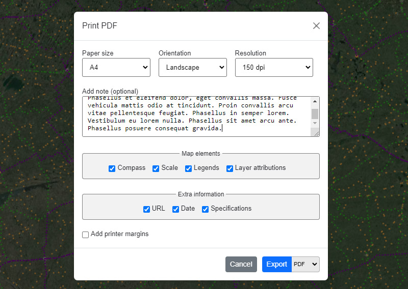
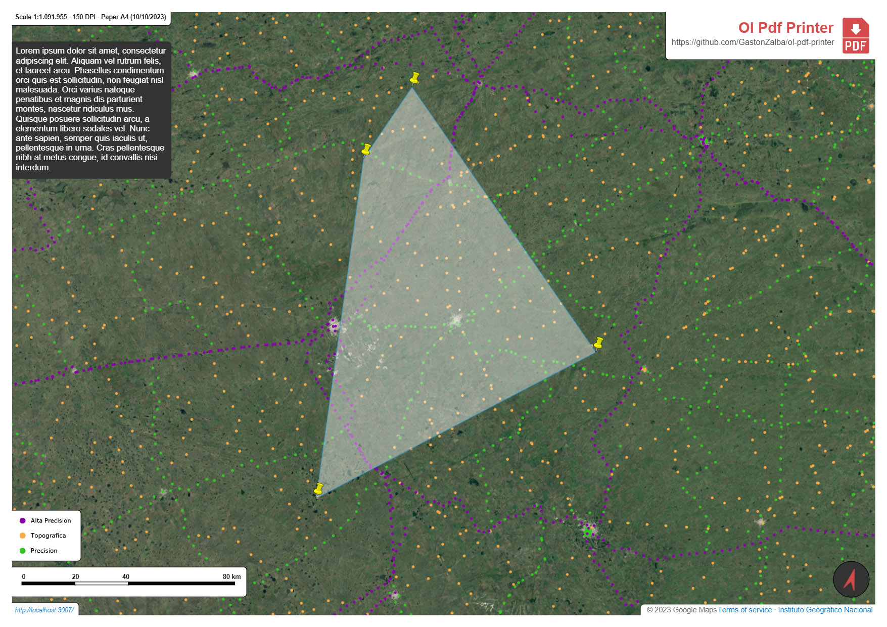

# OpenLayers Pdf Printer

<p align="center">
    <a href="https://www.npmjs.com/package/ol-pdf-printer">
        
    </a>
    <a href="https://img.shields.io/npm/dm/ol-pdf-printer">
        
    </a>
    <a href="https://github.com/gastonzalba/ol-pdf-printer/blob/master/LICENSE">
        
    </a>
</p>

Basic Pdf Printer for Open Layers.

Tested with OpenLayers version 5, 6, 7 and 8.

## IMPORTANT

WMS sources and Icons that use external urls must be setted to `crossOrigin: 'anonymous'`. Otherwise, it will ocurr a `DOMException: Failed to execute 'toDataURL' on 'HTMLCanvasElement': Tainted canvases may not be exported`.





## Examples

-   [Basic usage](https://raw.githack.com/GastonZalba/ol-pdf-printer/v1.3.0/examples/basic.html)

## Usage

```js
// Default options
var opt_options = {
    language: 'en',
    i18n: {...}, // Custom translations. Default is according to selected language
    showControlBtn: true,
    filename: 'Ol Pdf Printer',
    units: 'metric',
    style: {
        paperMargin: 10,
        brcolor: '#000000',
        bkcolor: '#273f50',
        txcolor: '#ffffff'
    },
    extraInfo: {
        date: true,
        url: true,
        scale: true
    },
    mapElements: {
        description: true,
        attributions: true,
        scalebar: true,
        compass: './assets/images/compass.svg',
        legends: true
    },
    watermark: {
        title: 'Ol Pdf Printer',
        titleColor: '#d65959',
        subtitle: 'https://github.com/GastonZalba/ol-pdf-printer',
        subtitleColor: '#444444',
        logo: false
    },
    paperSizes: [
        { size: [594, 420], value: 'A2' },
        { size: [420, 297], value: 'A3' },
        { size: [297, 210], value: 'A4', selected: true },
        { size: [210, 148], value: 'A5' }
    ],
    dpi: [
        { value: 72 },
        { value: 96 },
        { value: 150, selected: true },
        { value: 200 },
        { value: 300 }
    ],
    scales: [10000, 5000, 1000, 500, 250, 100, 50, 25, 10],
    mimeTypeExport: [
        { value: 'pdf', selected: true},
        { value: 'png' },
        { value: 'jpeg' },
        { value: 'webp' }
    ],
    dateFormat: undefined, // Use browser default
    ctrlBtnClass: '',
    modal: {
        animateClass: 'fade',
        animateInClass: 'show',
        transition: 300,
        backdropTransition: 150,
        templates: {
            dialog: '<div class="modal-dialog modal-dialog-centered"></div>',
            headerClose: `<button type="button" class="btn-close" data-dismiss="modal" aria-label="Close"><span aria-hidden="true">×</span></button>`
        }
    }
}

var pdfPrinter = new PdfPrinter(opt_options);

map.addControl(pdfPrinter);
```

## Changelog

See [CHANGELOG](./CHANGELOG.md) for details of changes in each release.

## Install

### Browser

#### JS

Load `ol-pdf-printer.js` after [OpenLayers](https://www.npmjs.com/package/ol), [jspdf](https://www.npmjs.com/package/jspdf) and PDF.js\[https://www.npmjs.com/package/pdfjs-dist]. Ol Pdf Printer is available as `PdfPrinter`.

```HTML
<script src="https://unpkg.com/ol-pdf-printer@1.3.0"></script>
```

#### CSS

```HTML
<link rel="stylesheet" href="https://unpkg.com/ol-pdf-printer@1.3.0/dist/css/ol-pdf-printer.css" />
<link rel="stylesheet" href="https://unpkg.com/ol-pdf-printer@1.3.0/dist/css/bootstrap.min.css" /> <!-- Bootstrap bundle -->
```

### Parcel, Webpack, etc.

NPM package: [ol-pdf-printer](https://www.npmjs.com/package/ol-pdf-printer).
Install the package via `npm`

    npm install ol-pdf-printer --save-dev

#### JS

```js
import PdfPrinter from 'ol-pdf-printer';
```

#### CSS

```js
import 'ol-pdf-printer/dist/css/ol-pdf-printer.min.css';
import 'ol-pdf-printer/dist/css/bootstrap.min.css'; // Bootstrap bundle
```

##### TypeScript type definition

TypeScript types are shipped with the project in the dist directory and should be automatically used in a TypeScript project. Interfaces are provided for the Options.

## API

<!-- Generated by documentation.js. Update this documentation by updating the source code. -->

#### Table of Contents

-   [PdfPrinter](#pdfprinter)
    -   [Parameters](#parameters)
    -   [showPrintSettingsModal](#showprintsettingsmodal)
    -   [hidePrintSettingsModal](#hideprintsettingsmodal)
    -   [createPdf](#createpdf)
        -   [Parameters](#parameters-1)
-   [IPrintOptions](#iprintoptions)
    -   [format](#format)
    -   [orientation](#orientation)
    -   [resolution](#resolution)
    -   [scale](#scale)
    -   [description](#description)
    -   [compass](#compass)
    -   [attributions](#attributions)
    -   [scalebar](#scalebar)
    -   [legends](#legends)
    -   [typeExport](#typeexport)
-   [IValues](#ivalues)
-   [I18n](#i18n)
-   [IPaperSize](#ipapersize)
    -   [size](#size)
    -   [value](#value)
    -   [selected](#selected)
-   [IScale](#iscale)
-   [IDpi](#idpi)
    -   [value](#value-1)
    -   [selected](#selected-1)
-   [IStyle](#istyle)
    -   [paperMargin](#papermargin)
    -   [brcolor](#brcolor)
    -   [bkcolor](#bkcolor)
    -   [txcolor](#txcolor)
-   [IMimeTypeExport](#imimetypeexport)
-   [IModal](#imodal)
    -   [animateClass](#animateclass)
    -   [animateInClass](#animateinclass)
    -   [transition](#transition)
    -   [backdropTransition](#backdroptransition)
    -   [templates](#templates)
-   [IWatermark](#iwatermark)
    -   [title](#title)
    -   [titleColor](#titlecolor)
    -   [subtitle](#subtitle)
    -   [subtitleColor](#subtitlecolor)
    -   [logo](#logo)
-   [IExtraInfo](#iextrainfo)
    -   [date](#date)
    -   [url](#url)
    -   [specs](#specs)
-   [IMapElements](#imapelements)
    -   [description](#description-1)
    -   [attributions](#attributions-1)
    -   [scalebar](#scalebar-1)
    -   [compass](#compass-1)
    -   [legends](#legends-1)
-   [Options](#options)
    -   [filename](#filename)
    -   [units](#units)
    -   [style](#style)
    -   [extraInfo](#extrainfo)
    -   [mapElements](#mapelements)
    -   [watermark](#watermark)
    -   [paperSizes](#papersizes)
    -   [dpi](#dpi)
    -   [scales](#scales)
    -   [mimeTypeExports](#mimetypeexports)
    -   [dateFormat](#dateformat)
    -   [showControlBtn](#showcontrolbtn)
    -   [ctrlBtnClass](#ctrlbtnclass)
    -   [modal](#modal)
    -   [language](#language)
    -   [i18n](#i18n-1)

### PdfPrinter

**Extends ol/control/Control~Control**

#### Parameters

-   `opt_options` **[Options](#options)?**&#x20;

#### showPrintSettingsModal

Show the Settings Modal

Returns **void**&#x20;

#### hidePrintSettingsModal

Hide the Settings Modal

Returns **void**&#x20;

#### createPdf

Create PDF programatically without displaying the Settings Modal

##### Parameters

-   `options` **[IPrintOptions](#iprintoptions)**&#x20;
-   `showLoading` **[boolean](https://developer.mozilla.org/docs/Web/JavaScript/Reference/Global_Objects/Boolean)**&#x20;

Returns **void**&#x20;

### IPrintOptions

**_\[interface]_**

#### format

Type: any

#### orientation

Type: (`"landscape"` | `"portrait"`)

#### resolution

Type: any

#### scale

Type: [IScale](#iscale)

#### description

Type: [string](https://developer.mozilla.org/docs/Web/JavaScript/Reference/Global_Objects/String)

#### compass

Type: [boolean](https://developer.mozilla.org/docs/Web/JavaScript/Reference/Global_Objects/Boolean)

#### attributions

Type: [boolean](https://developer.mozilla.org/docs/Web/JavaScript/Reference/Global_Objects/Boolean)

#### scalebar

Type: [boolean](https://developer.mozilla.org/docs/Web/JavaScript/Reference/Global_Objects/Boolean)

#### legends

Type: (LegendsOptions | [boolean](https://developer.mozilla.org/docs/Web/JavaScript/Reference/Global_Objects/Boolean))

#### typeExport

Type: any

### IValues

**_\[interface]_** - Custom translations specified when creating an instance

### I18n

**_\[interface]_** - Custom translations specified when creating an instance

### IPaperSize

**_\[interface]_**

#### size

Type: \[[number](https://developer.mozilla.org/docs/Web/JavaScript/Reference/Global_Objects/Number), [number](https://developer.mozilla.org/docs/Web/JavaScript/Reference/Global_Objects/Number)]

#### value

Type: [string](https://developer.mozilla.org/docs/Web/JavaScript/Reference/Global_Objects/String)

#### selected

Type: [boolean](https://developer.mozilla.org/docs/Web/JavaScript/Reference/Global_Objects/Boolean)

### IScale

**_\[type]_**

Type: [number](https://developer.mozilla.org/docs/Web/JavaScript/Reference/Global_Objects/Number)

### IDpi

**_\[interface]_**

#### value

Type: [number](https://developer.mozilla.org/docs/Web/JavaScript/Reference/Global_Objects/Number)

#### selected

Type: [boolean](https://developer.mozilla.org/docs/Web/JavaScript/Reference/Global_Objects/Boolean)

### IStyle

**_\[interface]_**

#### paperMargin

Type: [number](https://developer.mozilla.org/docs/Web/JavaScript/Reference/Global_Objects/Number)

#### brcolor

Type: [string](https://developer.mozilla.org/docs/Web/JavaScript/Reference/Global_Objects/String)

#### bkcolor

Type: [string](https://developer.mozilla.org/docs/Web/JavaScript/Reference/Global_Objects/String)

#### txcolor

Type: [string](https://developer.mozilla.org/docs/Web/JavaScript/Reference/Global_Objects/String)

### IMimeTypeExport

**_\[interface]_**

### IModal

**_\[interface]_**

#### animateClass

Type: [string](https://developer.mozilla.org/docs/Web/JavaScript/Reference/Global_Objects/String)

#### animateInClass

Type: [string](https://developer.mozilla.org/docs/Web/JavaScript/Reference/Global_Objects/String)

#### transition

Type: [number](https://developer.mozilla.org/docs/Web/JavaScript/Reference/Global_Objects/Number)

#### backdropTransition

Type: [number](https://developer.mozilla.org/docs/Web/JavaScript/Reference/Global_Objects/Number)

#### templates

Type: {dialog: ([string](https://developer.mozilla.org/docs/Web/JavaScript/Reference/Global_Objects/String) | [HTMLElement](https://developer.mozilla.org/docs/Web/HTML/Element))?, headerClose: ([string](https://developer.mozilla.org/docs/Web/JavaScript/Reference/Global_Objects/String) | [HTMLElement](https://developer.mozilla.org/docs/Web/HTML/Element))?}

### IWatermark

**_\[interface]_**

#### title

Type: [string](https://developer.mozilla.org/docs/Web/JavaScript/Reference/Global_Objects/String)

#### titleColor

Type: [string](https://developer.mozilla.org/docs/Web/JavaScript/Reference/Global_Objects/String)

#### subtitle

Type: [string](https://developer.mozilla.org/docs/Web/JavaScript/Reference/Global_Objects/String)

#### subtitleColor

Type: [string](https://developer.mozilla.org/docs/Web/JavaScript/Reference/Global_Objects/String)

#### logo

Type: (`false` | [string](https://developer.mozilla.org/docs/Web/JavaScript/Reference/Global_Objects/String) | [HTMLImageElement](https://developer.mozilla.org/docs/Web/API/HTMLImageElement) | [SVGElement](https://developer.mozilla.org/docs/Web/SVG/Element/animate))

### IExtraInfo

**_\[interface]_** - Print information at the bottom of the PDF

#### date

Print Date

Type: [boolean](https://developer.mozilla.org/docs/Web/JavaScript/Reference/Global_Objects/Boolean)

#### url

Current site url

Type: [boolean](https://developer.mozilla.org/docs/Web/JavaScript/Reference/Global_Objects/Boolean)

#### specs

DPI, Format and Scale information

Type: [boolean](https://developer.mozilla.org/docs/Web/JavaScript/Reference/Global_Objects/Boolean)

### IMapElements

**_\[interface]_** - MapElements

#### description

Print description

Type: [boolean](https://developer.mozilla.org/docs/Web/JavaScript/Reference/Global_Objects/Boolean)

#### attributions

Layers attributions

Type: [boolean](https://developer.mozilla.org/docs/Web/JavaScript/Reference/Global_Objects/Boolean)

#### scalebar

Scalebar

Type: [boolean](https://developer.mozilla.org/docs/Web/JavaScript/Reference/Global_Objects/Boolean)

#### compass

Compass image. North must be pointing to the top

Type: (`false` | [string](https://developer.mozilla.org/docs/Web/JavaScript/Reference/Global_Objects/String) | [HTMLImageElement](https://developer.mozilla.org/docs/Web/API/HTMLImageElement) | [SVGElement](https://developer.mozilla.org/docs/Web/SVG/Element/animate))

#### legends

Display WMS legends

Type: (LegendsOptions | [boolean](https://developer.mozilla.org/docs/Web/JavaScript/Reference/Global_Objects/Boolean))

### Options

**Extends ControlOptions**

**_\[interface]_** - Options specified when creating an instance

#### filename

Export filename

Type: [string](https://developer.mozilla.org/docs/Web/JavaScript/Reference/Global_Objects/String)

#### units

Map unit mode

Type: (`"metric"` | `"imperial"`)

#### style

Some basic PDF style configuration

Type: [IStyle](#istyle)

#### extraInfo

Information to be inserted at the bottom of the PDF
False to disable

Type: (`false` | [IExtraInfo](#iextrainfo))

#### mapElements

Elements to be showed on the PDF and in the Settings Modal.
False to disable

Type: (`false` | [IMapElements](#imapelements))

#### watermark

Watermark to be inserted in the PDF.
False to disable

Type: (`false` | [IWatermark](#iwatermark))

#### paperSizes

Paper sizes options to be shown in the settings modal

Type: [Array](https://developer.mozilla.org/docs/Web/JavaScript/Reference/Global_Objects/Array)<[IPaperSize](#ipapersize)>

#### dpi

DPI resolutions options to be shown in the settings modal

Type: [Array](https://developer.mozilla.org/docs/Web/JavaScript/Reference/Global_Objects/Array)<[IDpi](#idpi)>

#### scales

Map scales options to be shown in the settings modal

Type: [Array](https://developer.mozilla.org/docs/Web/JavaScript/Reference/Global_Objects/Array)<[IScale](#iscale)>

#### mimeTypeExports

Export format

Type: [Array](https://developer.mozilla.org/docs/Web/JavaScript/Reference/Global_Objects/Array)<[IMimeTypeExport](#imimetypeexport)>

#### dateFormat

Locale time zone. Default varies according to browser locale
<https://developer.mozilla.org/en-US/docs/Web/JavaScript/Reference/Global_Objects/Date/toLocaleDateString#using_locales>

Type: Locale

#### showControlBtn

Show the Btn toggler on the map

Type: [boolean](https://developer.mozilla.org/docs/Web/JavaScript/Reference/Global_Objects/Boolean)

#### ctrlBtnClass

ClassName to add to the Btn Control

Type: [string](https://developer.mozilla.org/docs/Web/JavaScript/Reference/Global_Objects/String)

#### modal

Modal configuration

Type: [IModal](#imodal)

#### language

Language support

Type: (`"es"` | `"en"`)

#### i18n

Add custom translations

Type: [I18n](#i18n)

## TODO

-   Interface comments
-   \~~Legends support~~
-   \~~Imperial units option for scalebar~~
-   \~~Customizable date format~~
-   Tests!
